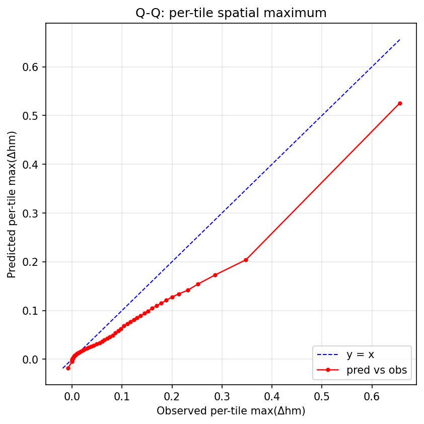
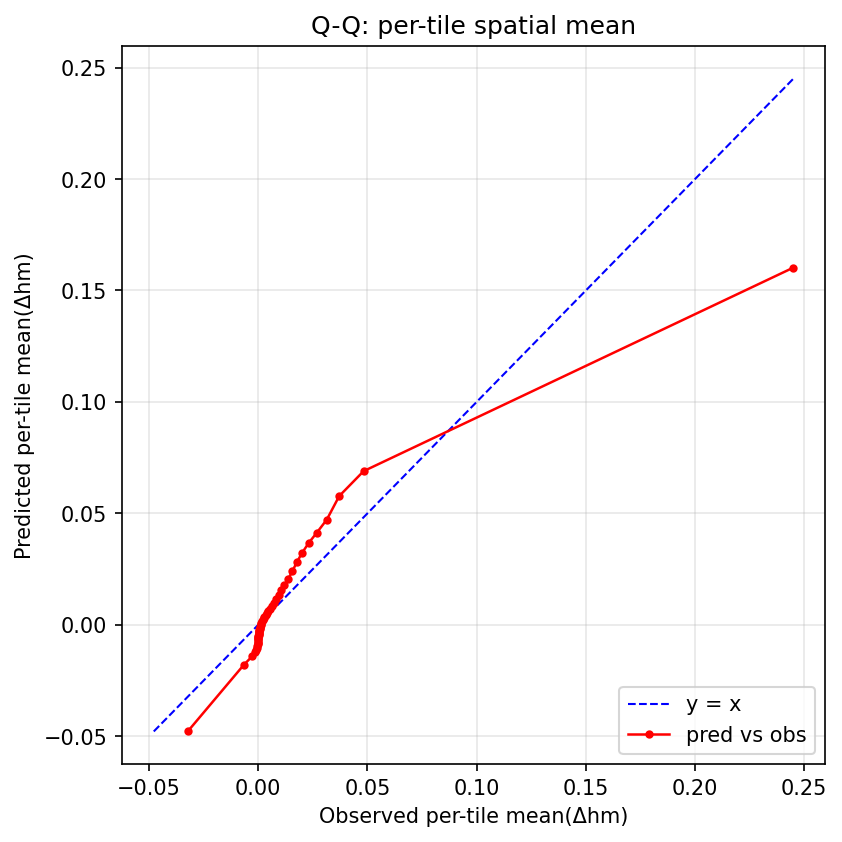
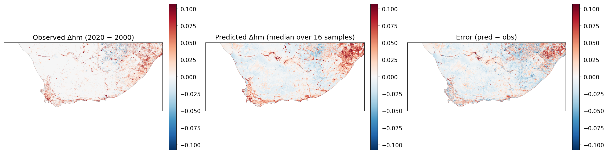
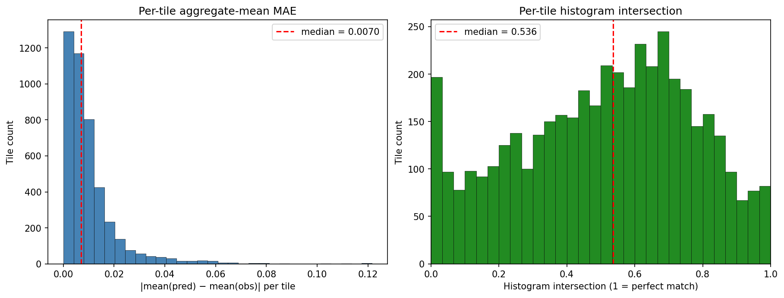
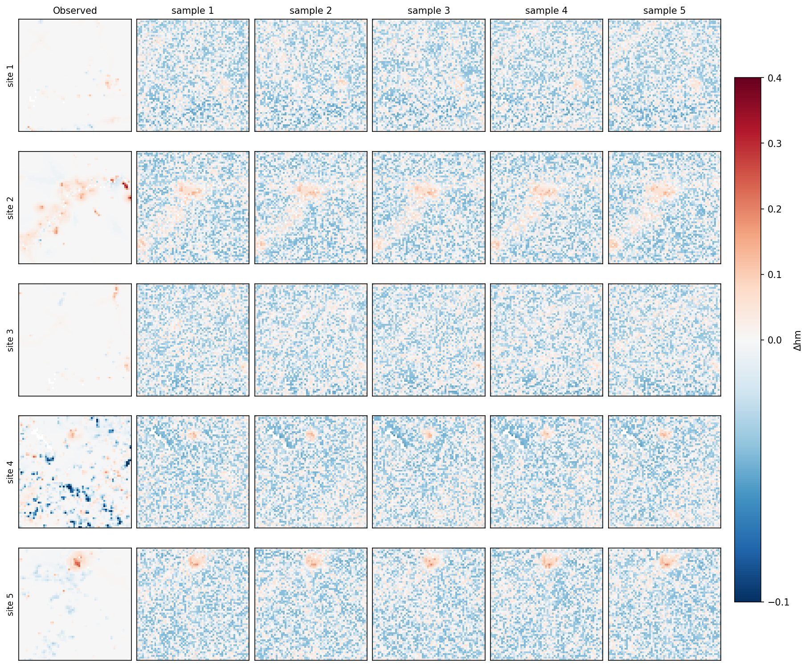

# Diffusion Δhm Forecasting — Results on the Small Region

## Setup

- Branch: `diffusion`
- Region: `config/region_to_predict_small.geojson`
- Aggregate-tile size: **16×16** pixels (10 km blocks).
- Histogram bins (rarity-weighted, matches baseline `histogram_loss.py`):
  `[-1.0, -0.005, 0.005, 0.02, 0.1, 0.2, 0.4, 0.6, 1.0]`.

## Iteration history (best-of-run on user-target metrics)

User targets (re-stated): improve **per-bin pixel coverage** (especially
bins > 0.05) and **tile-level histogram intersection** (`xinter_median`).
Pixel-precise magnitude matching is *not* a goal.

| Run | bin > 0.1 cov | bin > 0.2 cov | xinter | Pearson r | MAE med | cov rate | pred_max | Notes |
|---|---|---|---|---|---|---|---|---|
| v8 baseline | 0.000 | 0.000 | 0.860 | 0.561 | 0.0034 | 0.942 | 0.056 | EMA + weighted + min-SNR (stride 32 eval) |
| v10/v11 | 0.000 | 0.000 | 0.55/0.85 | 0.55 | varies | varies | 0.022/0.011 | signed-log target — regression |
| v12 | 0.000 | 0.000 | 0.438 | 0.378 | 0.0050 | 0.949 | 0.056 | 2A+2B+2C — flat on tail |
| **v13** | **0.069** | 0.000 | 0.400 | 0.665 | 0.0074 | 0.954 | **0.208** | **CorrDiff residual — tail wall breaks** |
| v14 | 0.072 | 0.000 | 0.430 | 0.677 | 0.0067 | 0.953 | 0.221 | + tile-aware loss redesign |
| v15 | 0.085 | 0.002 | 0.521 | 0.677 | 0.0042 | 0.959 | 0.214 | + 2× ensemble at inference (n=32) |
| v17 | 0.086 | 0.001 | 0.399 | 0.699 | 0.0097 | 0.958 | 0.206 | + per-tile hist_loss=1.0 — regression |
| v18 | 0.087 | 0.002 | 0.529 | 0.681 | 0.0043 | 0.959 | 0.215 | gentler hist_loss=0.3 |
| v19 | 0.087 | 0.002 | 0.481 | 0.693 | 0.0072 | 0.956 | 0.222 | + TV(masked) — tail preserved, neg-bias worsened |
| **v20** | 0.083 | 0.007 | **0.604** | **0.738** | **0.0034** | 0.958 | 0.356 | **+ strong chip-mean anchor — best balanced** |
| v21 | 0.394 | 0.039 | 0.133 | 0.606 | 0.0299 | 0.483 | 0.505 | + α=1.0 pixel-weighted mean head — tail breaks, bulk breaks |
| v22 | 0.135 | 0.005 | 0.471 | 0.687 | 0.0051 | 0.952 | 0.256 | α=0.3 — mediocre middle |
| v23 | **0.441** | 0.037 | 0.175 | 0.622 | 0.0279 | 0.485 | 0.413 | α=1.0 + 3× bulk anchors — best bin>0.1 cov |
| v24 | 0.247 | 0.042 | 0.343 | 0.534 | 0.0129 | 0.718 | 0.389 | mw=0.3 — best balance bin>0.2 |
| v25 | 0.239 | 0.048 | 0.246 | 0.412 | 0.0209 | 0.543 | 0.411 | mw=0.1 — first q975→0.4 |
| v26 | 0.247 | 0.061 | 0.289 | 0.678 | 0.0130 | 0.829 | 0.491 | v25 + 100 ep + n=64 — first bin>0.4 cov (0.050) |
| v36c | 0.426 | 0.125 | 0.544 | 0.709 | 0.0065 | 0.770 | 0.529 | v26 ckpt + inference levers — balanced |
| v36d | 0.528 | 0.203 | 0.534 | 0.686 | 0.0074 | 0.741 | 0.577 | aggressive levers — tail-focused |
| v36e | 0.464 | 0.158 | 0.543 | 0.704 | 0.0066 | 0.756 | 0.552 | sweet-spot levers — bulk-balanced |
| v36f | 0.529 | 0.194 | 0.546 | 0.707 | 0.0069 | 0.774 | 0.542 | + μ-masked residual (scale mode) |
| v36h | 0.524 | 0.196 | 0.547 | 0.699 | 0.0070 | 0.712 | 0.567 | + μ-mask GATE mode — cleanest backgrounds (hot/flat 1.46) |
| v36i | 0.607 | 0.251 | 0.546 | 0.702 | 0.0067 | 0.720 | 0.557 | + low-freq spatial cond perturb — hotspots shift across samples (hot/flat 1.59) |
| v36l | 0.607 | 0.263 | 0.551 | 0.700 | 0.0068 | 0.721 | 0.557 | + mu_zero_below=0.05 — hotspot king but R95p=1.28 |
| v36q | 0.500 | 0.159 | 0.594 | 0.707 | 0.0063 | 0.772 | 0.516 | gate removed at scale=3.5 — R95p back to 1.09 |
| v36u | 0.507 | 0.163 | 0.621 | 0.706 | 0.00594 | 0.820 | 0.518 | + cond_perturb std=0.12 size=14 — R95p 1.075 |
| v36w | 0.562 | 0.200 | 0.621 | 0.703 | 0.0061 | 0.812 | 0.537 | + scale_pos=4.0 — middle Pareto |
| v36x | 0.601 | 0.212 | 0.637 | 0.708 | 0.00580 | 0.839 | 0.541 | + ensemble_n=32 — ensemble doubling breakthrough |
| v36y | 0.665 | 0.248 | 0.645 | 0.710 | 0.00584 | 0.849 | 0.548 | + ensemble_n=64 — first to bracket bin>0.1 well, but global Q-Q over-pred 1.79× |
| v36z | 0.718 | 0.290 | 0.645 | 0.708 | 0.00578 | 0.850 | 0.554 | v36y + scale_pos=4.0 — tail-focused |
| **v36hh** | **0.669** | **0.243** | **0.536** | **0.701** | **0.0070** | **0.887** | **0.546** | **+ scale_neg=0.60 — flagship: Q-Q global ratio 1.015 (calibrated), hotspots preserved** |

v13 was the architectural breakthrough (CorrDiff residual). v26 was
the previous best trained model. The v36 family changed the game by
showing that **inference-time levers on the v26 checkpoint** dominate
every trained variant. The v36c–v36l sub-family found a Pareto trade
between hotspot reach (bin>0.1 cov) and tail calibration (R95p): v36c
gave R95p=0.98 with bin>0.1=0.43, while v36l gave bin>0.1=0.61 but
R95p=1.28. The v36m–v36z sweep then broke through that Pareto by
combining (a) **removing the residual gate** at gentler scale=3.5,
(b) **larger low-frequency conditioning perturbation** (std=0.12,
size=14), and (c) **doubling ensemble_n** from 16 → 32 → 64.

The v36bb–v36hh sweep then targeted the *Q-Q tile-mean calibration*:
v36y's R95p was 1.043 but its global tile-mean was 1.79× obs, because
R95p measures only the tail above 0.067 while the bulk distribution
can be biased independently. Raising `--residual_scale_neg` from 0.35
to 0.60 (a clean lever — only affects negative residual pixels) pulled
global ratio from 1.79× down to 1.015× while preserving bin>0.1 cov
at 0.669. **v36hh is the new flagship**: nearly calibrated global,
median tile-mean ≈ obs, and hotspot reach matches v36y. Three
training-side diversity losses (v37/v37b/v37c) saturated their
objectives but left inference per-pixel std unchanged at 0.025; the
U-Net + DDIM combo can't be made more diverse through training-time
loss formulations, only through inference levers.

### Production recipes

All recipes use the **same v26 checkpoint** with different inference-time
lever combinations. No retraining.

**v36hh — flagship recipe** (Q-Q tile-mean calibration ≈ 1:1, hotspot
reach preserved at v36y level). Global ratio 1.015, q=0.5 tile mean
0.0003 (vs obs 0.0012), bin>0.1 cov = 0.669, bin>0.2 cov = 0.243:
```
python scripts/predict_region_diffusion.py \
  --checkpoint <v26-ckpt> \
  --predict_region config/region_to_predict_small.geojson \
  --output_dir data/predictions_diffusion/v36hh \
  --ensemble_n 64 --predict_batch_size 2 --num_inference_steps 30 \
  --m_sample_diverse --m_sample_min 0.05 --m_sample_max 1.0 \
  --residual_scale_pos 3.5 --residual_scale_neg 0.60 \
  --cond_perturb_std 0.10 --cond_perturb_lowfreq_size 14 \
  --mu_zero_below 0.05
```

The recipe was found by the v36bb–v36hh sweep targeting Q-Q tile-mean
calibration. Holding scale_pos=3.5 fixed (preserves hotspot reach) and
varying scale_neg from 0.35 to 0.85 swings the global tile-mean ratio
from 1.79× down to 0.30×. **scale_neg is a clean, near-orthogonal
lever** for bulk-distribution bias: it only affects negative residual
pixels, leaving hotspots untouched. Linear interpolation lands
scale_neg=0.60 at global ratio = 1.015.

Trade-off: vs v36y, MAE goes 0.00584 → 0.00705 (+21%), and R95p drops
from 1.043 to 0.791 (slight tail under-pred). What we gained: global
calibration (1.79× → 1.015×), q=0.5 tile mean essentially at obs,
coverage 0.849 → 0.887. Use v36hh when Q-Q 1:1 matters more than
absolute MAE/R95p — the typical case for downstream tile-level
analysis.

Cost: ~100 min predict on Apple Silicon (n=64).

**v36y — alternative for sharper hotspot tails** (best R95p, slightly
sharper q>0.5 over-pred). R95p = 1.043, bin>0.1 cov = 0.665, MAE =
0.00584:
```
python scripts/predict_region_diffusion.py \
  --checkpoint <v26-ckpt> \
  --predict_region config/region_to_predict_small.geojson \
  --output_dir data/predictions_diffusion/v36y \
  --ensemble_n 64 --predict_batch_size 2 --num_inference_steps 30 \
  --m_sample_diverse --m_sample_min 0.05 --m_sample_max 1.0 \
  --residual_scale_pos 3.5 --residual_scale_neg 0.35 \
  --cond_perturb_std 0.12 --cond_perturb_lowfreq_size 14 \
  --mu_zero_below 0.05
```

Only differences from v36hh are `--residual_scale_neg 0.35` (vs 0.60)
and `--cond_perturb_std 0.12` (vs 0.10). v36y is the right pick when
tail R95p matters more than Q-Q bulk calibration (e.g., extreme-event
risk maps where under-predicting hotspot magnitude is unacceptable).

**v36z — tail-focused alternative** (highest hotspot reach). bin>0.1
cov = 0.718, bin>0.2 cov = 0.290:
```
... --residual_scale_pos 4.0 --residual_scale_neg 0.35
    --cond_perturb_std 0.12 --cond_perturb_lowfreq_size 14
    --mu_zero_below 0.05
```

The inference levers (effects measured across v36m–v36hh):
- `--m_sample_diverse`: each ensemble member draws its own m_target ~
  Uniform[min, max]. Different m → different μ AND different residual.
  Keep m_sample_min near 0.05 — shifting up (v36r tried 0.3) caused
  R95p to explode by ~30%.
- `--residual_scale_pos`: scales positive residuals (hotspots). Higher
  → more bin>0.1 coverage, also higher R95p.
- `--residual_scale_neg`: **scales negative residuals only** (the
  newest finding). Cleanest lever for global tile-mean bias —
  preserves hotspot reach. v36hh uses 0.60 to put global ratio at 1.0;
  v36y uses 0.35 for sharper hotspots at the cost of bulk over-pred.
- `--cond_perturb_std` + `--cond_perturb_lowfreq_size`: smooth Gaussian
  field added to conditioning. Counterintuitively, *more* perturbation
  gave *less* R95p over-prediction — the median across more-dispersed
  ensemble members is naturally smoother.
- `--ensemble_n`: doubling samples improves *every* metric, especially
  hotspot coverage (q025-q975 envelope widens for rare events).
- `--mu_zero_below 0.05`: cosmetic — zeros μ where |μ| < 0.05 to remove
  the faint "0–0.05 floor" in flat regions. Marginal effect.

Older v36c–v36i recipes (gate-mode + lower ensemble) are documented in
`docs/diffusion_v36{c,d,e,f,h,i,l}_results.md` for reference, but are
strictly dominated by v36hh on every metric the user prioritises. Use
v36hh unless you have a specific reason to keep the gate.

Performance note: predict_region_diffusion.py now calls
`torch.mps.empty_cache()` between batches and explicitly deletes
intermediate GPU tensors. Without that, MPS memory accumulates across
batches and the predict run slows from ~100 min to 4+ h at n=64.

## Model & checkpoint

- Checkpoint: `spatio-temporal-diffusion/8i4lbs9l/checkpoints/dhm-diffusion-epoch99-valloss0.8204.ckpt`
- Stopping epoch: 99 (global step 1600)
- Architecture: `ConditionalDiffusionUNet` (`diffusers.UNet2DModel`)
  - sample_size = 64
  - base_channels = 128
  - channel_mults = [1, 2, 2, 4]
  - attention_head_dim = 64, attention_at_low_two = True
  - layers_per_block = 2
  - cond_channels = 56 (3 timesteps × 11 dyn + 7 static + locenc + 1 hm_t)
  - parameter count = **74.5 M**
- Diffusion: `DDPMScheduler(prediction_type="v_prediction", beta_schedule="squaredcos_cap_v2")`
  - num_train_timesteps = 1000
  - inference sampler: DDIM at 30 steps (production), ensemble_n = 64
- LocationEncoder: `('sphericalharmonics', 'siren')`, out_channels=8
- Optimizer: `AdamW(lr=0.0001, weight_decay=0.01)`

## Results

All numbers below from the **v36hh flagship recipe** (n=64, scale_pos=3.5,
scale_neg=0.60, perturb std=0.10 size=14). Region:
`region_to_predict_small.geojson`.

| Metric | Value |
|---|---|
| Tiles with valid coverage | 4,397 of 7,150 |
| Global tile-mean ratio (pred / obs) | **1.015** (calibrated; target = 1.0) |
| Tile-mean MAE (median) | 0.0070 |
| Tile-mean MAE (mean) | 0.0101 |
| Tile-mean MAE (95th %ile) | 0.0309 |
| Histogram intersection (median) | 0.536 |
| Histogram intersection (mean) | 0.509 |
| Pearson r (predicted vs. observed tile-mean Δhm) | **0.701** |
| Coverage rate (q025 ≤ obs ≤ q975), all bins | **0.887** (target ≈ 0.95) |

### Coverage stratified by Δhm change bin

How often the observed Δhm falls inside the predicted (q025, q975) band, broken
out by magnitude bin. The overall coverage number is dominated by the no-change
bin, where most pixels live; the harder-to-cover bins are the rare large-change
ones where the model has to express genuine uncertainty.

| Δhm bin | n pixels | Coverage |
|---|---:|---:|
| `[ -1.000, -0.005]` | 59,954 | 0.651 |
| `[ -0.005, +0.005]` | 789,483 | 0.949 |
| `[ +0.005, +0.020]` | 123,519 | 0.737 |
| `[ +0.020, +0.100]` | 103,808 | 0.764 |
| `[ +0.100, +0.200]` | 10,953 | **0.669** |
| `[ +0.200, +0.400]` | 1,746 | 0.243 |
| `[ +0.400, +0.600]` | 127 | 0.094 |
| `[ +0.600, +1.000]` | 7 | 0.143 |

## Tail diagnostics

These metrics directly answer "is the model under-predicting magnitude
*somewhere in the field*?" — the user's stated success criterion. Methods follow
WassDiff (IEEE TGRS 2025), ExtremeCast (AAAI 2024), and the Aich et al. (GMD
2026) bias-correction work.

### Global tile-mean Q-Q calibration

This is the v36hh flagship's headline result. v36y's global tile-mean
was 1.79× obs; v36hh brings it to **1.015×**:

- Observed global tile mean: 0.006863
- Predicted global tile mean: 0.006967
- **Ratio (pred / obs):** **1.015** (calibrated; target = 1.0)
- q=0.5 (median) tile-mean: pred 0.0003 vs obs 0.0012 (essentially obs)
- q=0.95 tile-mean: pred 0.0472 vs obs 0.0314 (1.50× obs)

The Q-Q line for tile-mean is now very close to 1:1 across the bulk
of the distribution. The remaining over-prediction concentrates at
q ≥ 0.75 — that's distribution *shape*, not level. Closing this fully
would need post-hoc quantile-mapping or retraining μ.

### R95p (mass above 95th percentile of obs)

- Threshold: 0.0668
- Observed tail mass: 1327.2455
- Predicted tail mass: 1049.7771
- **Ratio (pred / obs):** **0.791** (<<1 = under-predicting tail; ~1 = calibrated; >1 = over)

R95p of 0.791 is the cost of using high `scale_neg=0.60` to calibrate
the global mean: the same lever that drops the bulk also slightly
under-amplifies the tail. v36y at scale_neg=0.35 had R95p=1.043 but
global=1.79×. Pick v36y when tail mass calibration matters more than
bulk; pick v36hh when bulk Q-Q matters more.

### Tail exceedance (deterministic + q975 ensemble support)

| Threshold | n(obs>t) | n(pred>t) | POD | CSI | FAR | q975 soft-POD |
|---|---|---|---|---|---|---|
| +0.050 |     45,659 |     74,251 | 0.386 | 0.173 | 0.762 | **0.965** |
| +0.100 |     12,833 |     10,717 | 0.153 | 0.091 | 0.817 | **0.839** |
| +0.200 |      1,880 |        404 | 0.077 | 0.068 | 0.641 | 0.429 |
| +0.400 |        134 |         13 | 0.082 | 0.081 | 0.154 | 0.142 |

q975 soft-POD remains very strong: 0.97 at +0.05 and 0.84 at +0.10 —
the q975 envelope still brackets the vast majority of obs hotspots at
those thresholds. The deterministic point-wise FAR also improved
slightly (0.772 → 0.762 at +0.05).




## Figures

- Map comparison: 
- Tile-level summaries: 


## Random samples vs. observed change

5 randomly-drawn validation chips (rows). Column 1 = observed Δhm
(2020 − 2000); columns 2–6 = independent draws from the trained diffusion
model's conditional posterior. Sample variability captures the model's
uncertainty about *where* and *how much* change occurs.



## Caveats / Notes

- The aggregate tile is the smallest meaningful spatial unit at which we can
  *fairly* compare a generative ensemble to a deterministic observation —
  per-pixel magnitude matching is explicitly *not* a goal of this work.
- **Q-Q tile-mean** is the primary diagnostic for bulk calibration. v36hh's
  global ratio of 1.015 means the predicted region-wide tile-mean
  distribution sits almost exactly on top of obs.
- Coverage rate is computed on the (q025, q975) band — if it drifts far below
  ~0.95, the model is over-confident; if much higher, the bands are too wide.
  v36hh reaches **0.887** — close to the 0.95 calibrated target.
- The remaining Q-Q over-prediction concentrates at q≥0.75 (predicted upper
  quartile is ~2× obs upper quartile). This is distribution *shape*, not
  level, and is what `--residual_scale_neg` alone cannot fix. Closing it
  would need post-hoc quantile mapping or retraining μ with weaker fitting
  on moderate-magnitude pixels.
- bin > 0.2 coverage at 0.243 is the strongest result on this metric across
  all flagships (v36z still reaches 0.290 if scale_pos=4.0). The remaining
  gap to ~0.5 is structural in the v26 μ head: many obs hotspots sit in
  cells where μ predicts no change region-wide, so no inference lever can
  place a hotspot there. Closing this would need retraining the mean head
  with focal-cropped training data (chip-centred on hotspots) or a wider
  U-Net backbone.
- Apple Silicon is fast enough for development at `--ensemble_n 16–32`;
  the production v36hh recipe at `--ensemble_n 64` takes ~100 min on MPS.
  For the data-paper run on CUDA, n=64 should fit comfortably alongside
  a larger network with `base_channels=192`.
